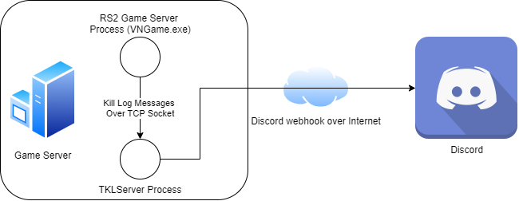

# TKLServer - Discord webhook integration for TKLMutator

Server for [TKLMutator](https://github.com/tuokri/rs2-tklogging)
for Discord webhook integration.
TKLMutator is a Rising Storm 2: Vietnam server mutator, which provides utilities 
for server administrators.

**Q:** Why is TKLServer needed?

**A:** RS2: Vietnam mods do not support HTTPS, which is required for
Discord webhooks.

### Installation option 1 (Requires Git + Python 3.6 or newer)

1. Clone TKLServer repository:

    `git clone https://github.com/tuokri/tklserver`

    `cd tklserver`

2. Install requirements:

    `pip install -r requirements`

3. Run the TKLServer:

    `python run.py`

4. Start RS2: Vietnam game server with TKLMutator enabled.

### Installation option 2 (Download executable)

STANDALONE TKLSERVER EXECUTABLE (.exe) COMING SOON.

### Configuration examples

##### 1 RS2 server and 1 Discord webhook URL

1 RS2: Vietnam game server process and 1 TKLServer process on the
same dedicated server machine.



**tklserver.ini** (in tklserver directory)
```ini
[tklserver]
port=8586
host=localhost

[rs2server.0000]
webhook_url=YOUR_SECRET_DISCORD_WEBHOOK_URL_HERE
```

**ROGame_TKLMutator.ini** (in RS2 server directory under `ROGame\Config`)
```ini
[TKLMutator.TKLMutator]
bLogTeamKills=True
bLogKills=False
bSendLogToServer=True
TKLFileName=KillLog

[TKLMutator.TKLMutatorTcpLinkClient]
TKLServerHost=localhost
TKLServerPort=8586
MaxRetries=5
UniqueRS2ServerId=0000
```

`UniqueRS2ServerId` in **ROGame_TKLMutator.ini** references `[rs2server.0000]` in **tklserver.ini**.
This needs to change only when support for multiple RS2: Vietnam game servers is needed.

`TKLServerPort` in **ROGame_TKLMutator.ini** must match `port` in **tklserver.ini**.

`bSendLogToServer` must be `True` in **ROGame_TKLMutator.ini**.
